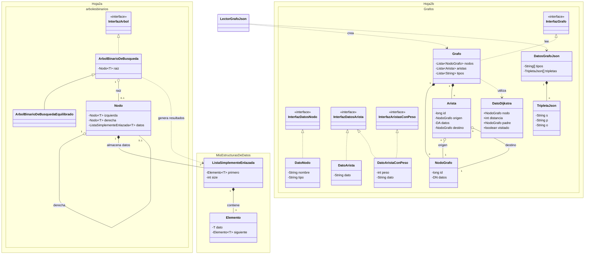

# PL2

## Asignatura: Estructuras de Datos

## Grupo: H12GEXTRA

## Integrantes
- Marcos Castro Rubio - [Marcoscastro9]
- Ventura Pacheco Pastilla - [Ventura1107]
- Marino Rodríguez Moreno - [Marinakis14]

## Lenguaje: java

## Entorno: IntelliJ

## Diagrama UML simplificado
Dentro de las carpetas correspondientes del arbol binario de búsqueda y del grafo, se encuentran diagramas UML mas 
elaborados junto con las clases main y las clases de prueba que no aparecen en este diagrama.

